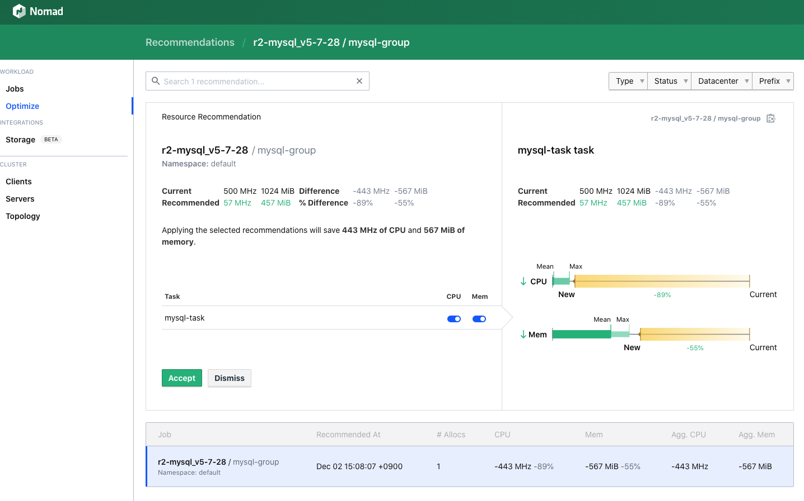

# nomad-dynamic-app-sizing-demo



## setup

* Install `nomad-autoscaler`

```
prometheus --config.file=prometheus.yml --web.listen-address=:9090
```

```
nomad-autoscaler -version
nomad-autoscaler agent -config das-autoscaler.hcl
```

```shell script
nomad job run -hcl1 mysql-das.nomad
```